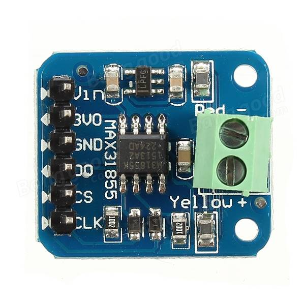
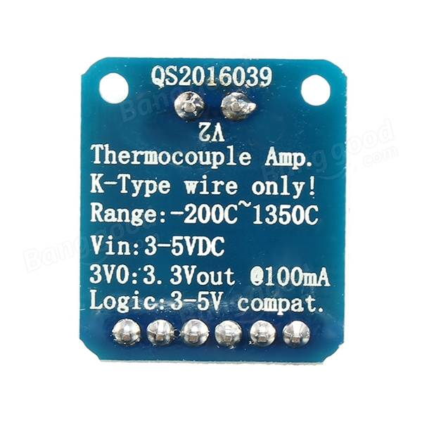
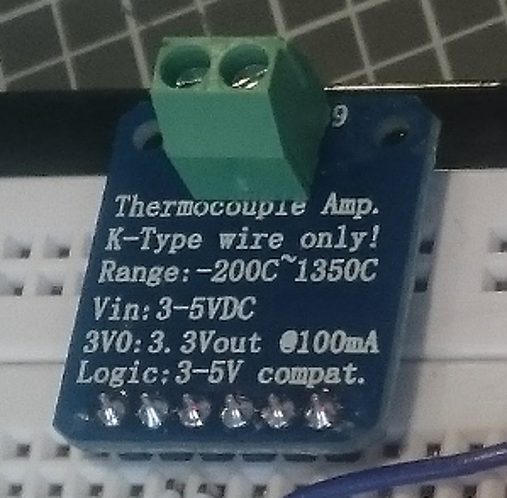
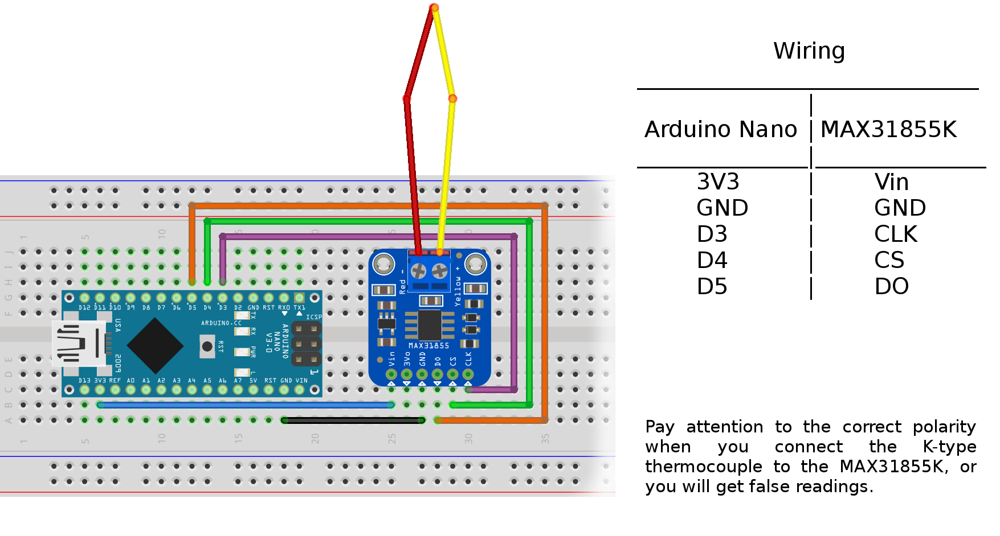

# **Temperature Control**

A basic temperature control example that uses to read in a temperature via a K-Type thermocouple sensor (TODO).
The volt output of the sensor is processed by an MAX31855 board (TODO) and read out by an Arduino Nano (TODO).
The so gained temperature value is given out through the serial console of the Arduino Nano.
On the output side a mosfet/relay is connected to the arduino board on the PWM pins, thus controlling a connected heater till a given target temperature is reached.

## Instructions

### What you need:

* [Thermocouple](https://www.banggood.com/de/Universal-K-Type-EGT-Thermocouple-Temperature-Sensors-For-Exhaust-Gas-Probe-p-1011377.html?rmmds=search&cur_warehouse=CN)
* [MAX31855 K-Type thermoelement breakout board for arduino](https://www.banggood.com/de/MAX31855-K-Type-Thermocouple-Breakout-Board-Temperature-Measurement-Module-For-Arduino-p-1086523.html?currency=EUR)
* [Arduino Nano clone](https://www.banggood.com/de/ATmega328P-Arduino-Compatible-Nano-V3-Improved-Version-No-Cable-p-959231.html?gmcCountry=AT&currency=EUR&createTmp=1&utm_source=googleshopping&utm_medium=cpc_elc&utm_content=zouzou&utm_campaign=pla-at-arduino-pc&gclid=EAIaIQobChMIm8_gxOD-1gIVBl8ZCh32wQj4EAQYAiABEgIKwfD_BwE&cur_warehouse=CN)
* you will also need a soldering iron, jumper cables, breadbord etc.

### Setup

__Hardware__

1. Resolder the plug onto the other side of the MAX31855K breakout board, so that it can be easily attach it to the breadboard.

2. Connect the Arduino nano with the MAX31855K breakout board according to following circuit diagram.

* You can find the Fritzing wiring diagram file (tempControl.fzz) in the docs folder.

__Software__

1. Download and install the newest Arduino IDE from https://www.arduino.cc/en/Main/Software. 

2. If you need help using Arduino have a look at www.arduino.cc/en/Guide/HomePage. 
    
3. Install the newest Arduino IDE from https://www.arduino.cc/en/main/software (version 1.8.5 at time of writing). 
    
4. Open "Menu->Sketch->Include Libraries->Manage Libraries.." in the Arduino IDE and search for "Adafruit MAX31855" and install it. 

### Programming

1. Open the "tempControl.ino" file that you can find here, "Verify" and "Upload" it to your Arduino board via USB connection
    
2. Once the code upload finishes verifying, open the serial monitor (found in the ‘Tools’ menu). You should be able to read the temperature your thermocouple is detecting on the serial monitor in reak time. If it isn’t working, make sure you have assembled the circuit correctly and verified and uploaded the code to your board. 

### Explanation

__1. K Type Thermocouple__

A thermocouple is a kind of temperature sensor, simply made by welding together two metal wires. Because of a physical effect of two joined metals, there is a slight but measurable voltage across the wires that increases with temperature (Seebeck-Effekt). The main advantage of using a thermocouple is the high temperature range (our K type: -200°C to 1200°C). A difficulty in using them is that the voltage to be measured is very small, with changes of about 50 uV per °C. To solve this we are using a thermocouple interface chip (MAX31855K) to measure the voltage between the wires. If you find that the thermocouple temperature goes down instead of up when heated, when connecting the K type thermocouples with the MAX31855K, try swapping the red and yellow wires.

__2. MAX31855K__

The MAX31855K is a chip that converts the voltage output of the thermocouple to a digital temperature value that is read out via SPI 
protocol. The first assembly step is creating a reliable, electrical connection from the MAX31855K breakout board to your Arduino. We chose 
to use a breakout board because we wanted to connect it to a bread board. The hookup is fairly straightforward. Connect the Arduino, MAX31855K and thermocouple as described in the Fritzing wiring diagram.

__3. Arduino nano__

The Arduino nano communicates with the MAX31855K through SPI protocol. For further details see next point.

__4. SPI protocol__

The SPI is a fast synchronous protocol that tipically uses uses 4 pins for communication, wiz. MISO, MOSI, SCK, and SS. These pins are directly related to the SPI bus interface.

    1. MISO – MISO stands for Master In Slave Out. MISO is the input pin for Master AVR, and output pin for Slave AVR device. Data transfer from Slave to Master takes place through this channel.
    2. MOSI – MOSI stands for Master Out Slave In. This pin is the output pin for Master and input pin for Slave. Data transfer from Master to Slave takes place through this channel.
    3. SCK – This is the SPI clock line (since SPI is a synchronous communication).
    4. SS – This stands for Slave Select. This pin would be discussed in detail later in the post.

## License

Distributed under the GNU LGPL v.3.0.

## References

* [Thermocouple](https://www.banggood.com/de/Universal-K-Type-EGT-Thermocouple-Temperature-Sensors-For-Exhaust-Gas-Probe-p-1011377.html?rmmds=search&cur_warehouse=CN)
* [MAX31855 K-Type thermoelement breakout board for arduino](https://www.banggood.com/de/MAX31855-K-Type-Thermocouple-Breakout-Board-Temperature-Measurement-Module-For-Arduino-p-1086523.html?currency=EUR)
* [Arduino Nano clone](https://www.banggood.com/de/ATmega328P-Arduino-Compatible-Nano-V3-Improved-Version-No-Cable-p-959231.html?gmcCountry=AT&currency=EUR&createTmp=1&utm_source=googleshopping&utm_medium=cpc_elc&utm_content=zouzou&utm_campaign=pla-at-arduino-pc&gclid=EAIaIQobChMIm8_gxOD-1gIVBl8ZCh32wQj4EAQYAiABEgIKwfD_BwE&cur_warehouse=CN)
* [henrysbench arduino-max31855 tutorial](http://henrysbench.capnfatz.com/henrys-bench/arduino-temperature-measurements/max31855-arduino-k-thermocouple-sensor-manual-and-tutorial/)
* [MAX31855 specs and datasheet](https://www.maximintegrated.com/en/products/analog/sensors-and-sensor-interface/MAX31855.html)
* [ATmega328 Datasheet](http://www.atmel.com/Images/Atmel-42735-8-bit-AVR-Microcontroller-ATmega328-328P_Datasheet.pdf)
* [Arduino Nano Pinout Diagram](http://www.pighixxx.com/test/wp-content/uploads/2014/11/nano.png)
* [Arduino Anleitung](www.arduino.cc/en/Guide/HomePage)
* [K-Type Thermocouple specs](https://www.thermocoupleinfo.com/type-k-thermocouple.htm)

## TODOs

* Solid State Relais
* PID-controller
* GUI

## Authors

* quirxi (https://github.com/quirxi)
* Cubemast3r (https://github.com/Cubemast3r)
 
